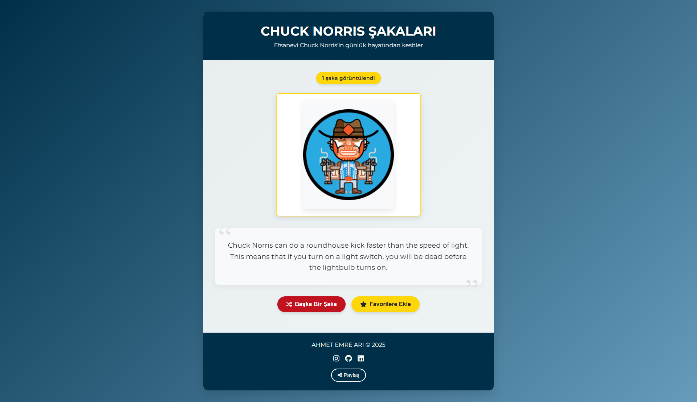

# Chuck Norris Şakaları / Chuck Norris Jokes

## 🇹🇷 Türkçe

### Proje Hakkında
Bu web uygulaması, efsanevi aksiyon yıldızı Chuck Norris hakkında eğlenceli şakalar sunan interaktif bir platformdur. Uygulama, resmi Chuck Norris API'sini kullanarak rastgele şakalar gösterir.

### Özellikler
- Resmi Chuck Norris API'si ile entegrasyon
- Rastgele şaka gösterme
- Şakaları favorilere ekleme
- Sosyal medya platformlarında paylaşım seçenekleri
- Duyarlı tasarım (mobil ve masaüstü uyumlu)
- Animasyonlar ve kullanıcı bildirimleri
- Klavye kısayolları (sağ ok tuşu veya boşluk tuşu)

### Teknoloji Yığını
- HTML5
- CSS3
- JavaScript (ES6+)
- Font Awesome
- Chuck Norris API (https://api.chucknorris.io/)

### Kurulum ve Kullanım
1. Bu depoyu klonlayın
2. `index.html` dosyasını tarayıcınızda açın
3. "Başka Bir Şaka" düğmesine tıklayarak yeni şakalar alın
4. Beğendiğiniz şakaları favorilere ekleyin ve paylaşın

## 🇬🇧 English

### About The Project
This web application is an interactive platform that offers fun jokes about the legendary action star Chuck Norris. The application displays random jokes using the official Chuck Norris API.

### Features
- Integration with the official Chuck Norris API
- Random joke generator
- Add jokes to favorites
- Social media sharing options
- Responsive design (mobile and desktop compatible)
- Animations and user notifications
- Keyboard shortcuts (right arrow key or space bar)

### Technology Stack
- HTML5
- CSS3
- JavaScript (ES6+)
- Font Awesome
- Chuck Norris API (https://api.chucknorris.io/)

### Installation and Usage
1. Clone this repository
2. Open the `index.html` file in your browser
3. Click the "New Joke" button to get new jokes
4. Add jokes you like to favorites and share them

## License
MIT

---

Oluşturucu / Created by: [ahmetemreari](https://github.com/ahmetemreari)]